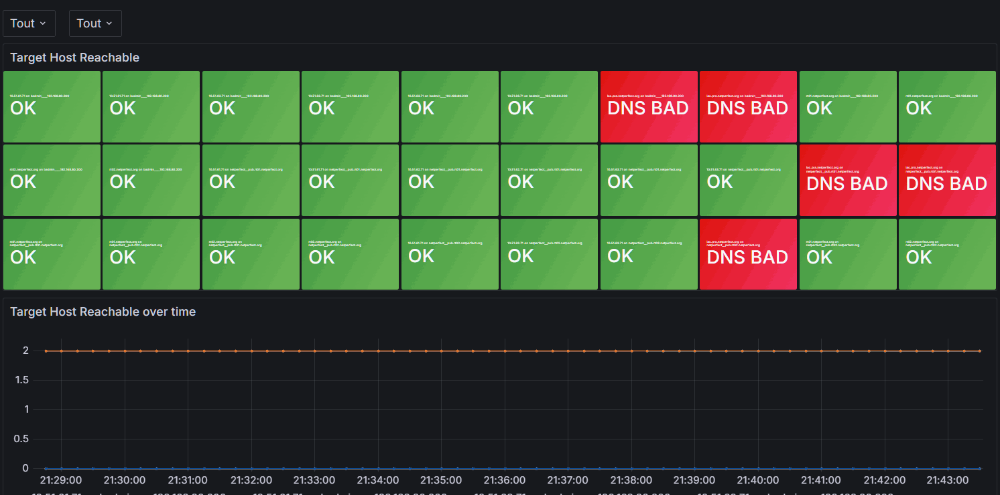

## node_exporter hosts up script

This is a quick and dirty script to check if a host that runs node_exporter can ping other hosts  

The main goal of this script is to check VPN peer reachability from the host.  

## Why

Host reachability checks can be used for Wireguard / IPSec / OpenVPN / GRE / VxLan tunnels, routing checks or general internet availability.

So why not simply use `blackbox_exporter` ?  
Because this can be installed quickly on almost any host supporting `node_exporter` and doesn't need another open port to query.

## Grafana example

The following example dashboard shows host reachability from other hosts.  
The dashboard can be found in the `grafana_example` directory.



## Setup

Download file `hosts_up.sh`:

```
cd /usr/local/bin && curl -OL https://raw.githubusercontent.com/netinvent/node_exporter_hosts_up/main/hosts_up.sh && chmod +x /usr/local/bin/hosts_up.sh
```

Create file `/etc/hosts_up.conf` containing the following
Change hosts to whatever you need

```
#/usr/bin/env bash

# hosts_up.sh configuration file
# see https://github.com/netinvent/node_exporter_hosts_up

# Operations are run in parallel
# Keep in mind that PING_INTERVAL * RETRIES * TIMEOUT should not exceed your prometheus scrape interval
PING_INTERVAL=.2
PING_RETRIES=3
PING_TIMEOUT=2

NODE_EXPORTER_TEXT_COLLECTOR_DIR="/var/lib/node_exporter/textfile_collector"
PROM_FILE="hosts_up.prom"
#LOG_FILE="/var/log/hosts_up.log"
LOG_FILE=""

# Optional type label
OPTIONAL_PROMETHEUS_TYPE_LABEL="vpn"

declare -a ping_hosts=(kernel.org 1.1.1.1 9.9.9.9 linux.org)
```

## Create a cron entry with the following

```
echo "* * * * * root /usr/local/bin/hosts_up.sh --config=/etc/hosts_up.conf" >> /etc/crontab
```

Since cron has a minute resolution, if you need to run this test more than every minute, you might add 3 other lines to cron like the following to run every 15 seconds:
```
* * * * * root sleep 15; /usr/local/bin/hosts_up.sh --config=/etc/hosts_up.conf"
* * * * * root sleep 30; /usr/local/bin/hosts_up.sh --config=/etc/hosts_up.conf"
* * * * * root sleep 45; /usr/local/bin/hosts_up.sh --config=/etc/hosts_up.conf"
```


## node_exporter remarks

Note that node_exporter needs to have plugin `text_collector` enabled.  
You can check your systemd service file which should look like
```
ExecStart=/usr/local/bin/node_exporter --collector.textfile.directory=/var/lib/node_exporter/textfile_collector
```